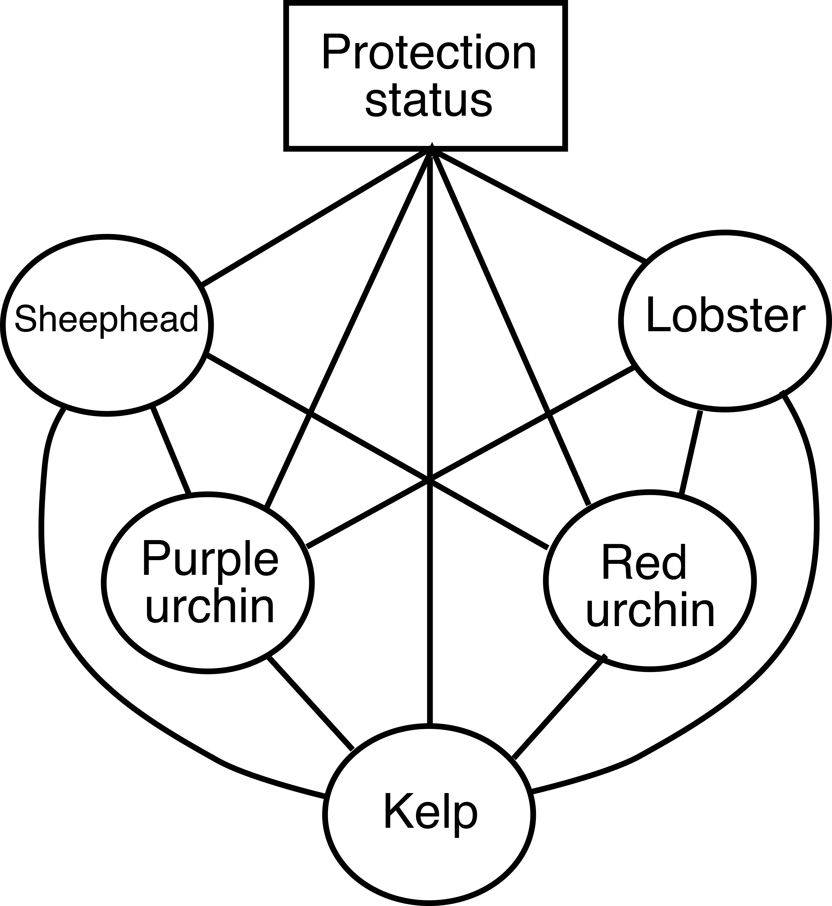
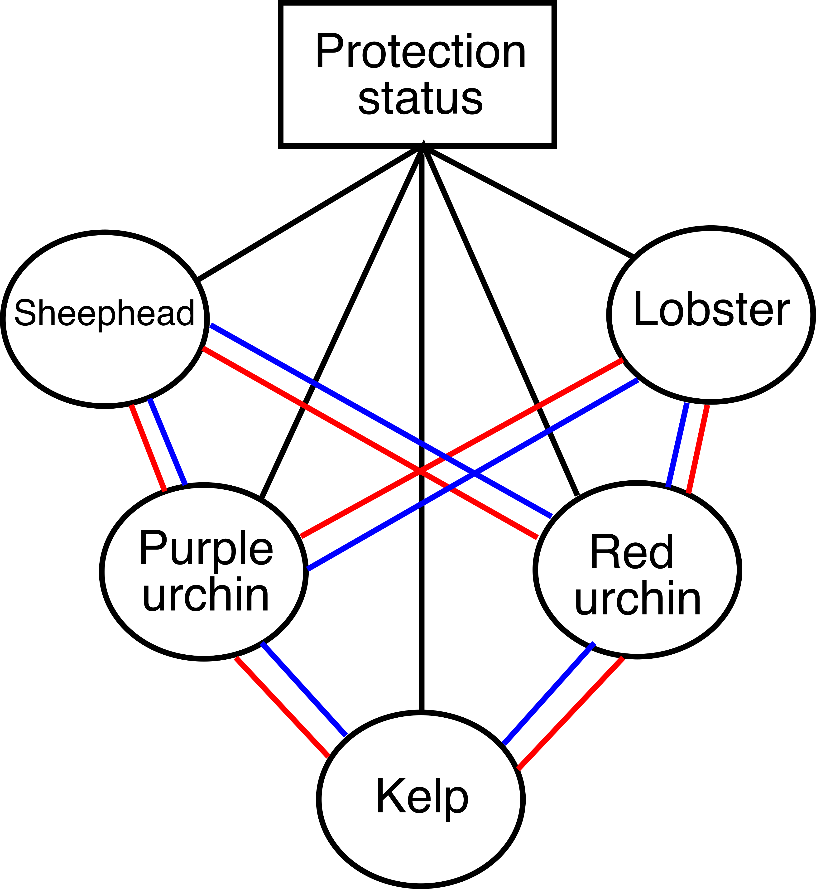
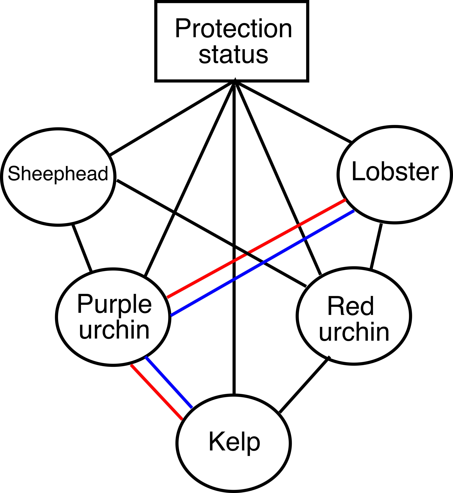
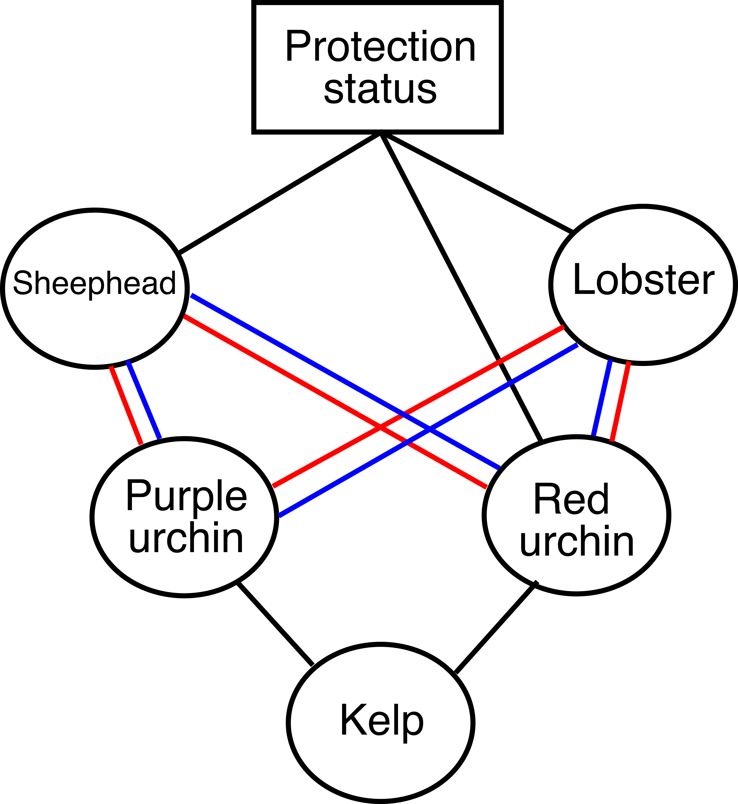
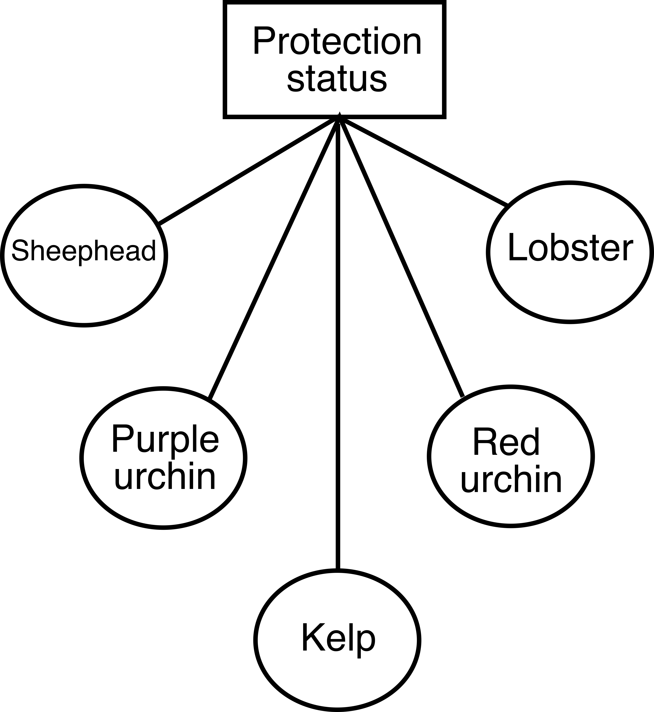
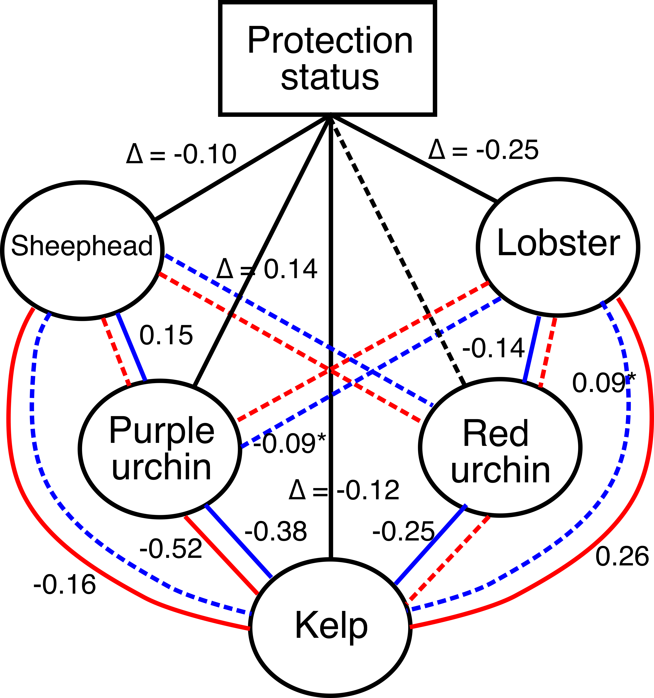

```{r setup, include=FALSE}
knitr::opts_chunk$set(echo = F, include = F)
```

The goal of this analysis is to determine if the correlations between different trophic guilds differ between protected and protected sites. Specifically, we are modeling the observational data 5-years post MPA implementation. 

Traditional SEM allow for categorical*continuous interactions. However, piecewise SEM's cannot yet accomodate a global interaction (e.g. MPA_status x everything else). Therefore, I am following Douma and Shipley (2021, Ecosphere). They present a reproducible procedure through which to test for global interactions by imposing sequential contraints on a system of linear regressions. 

This documents represents a summary of lots of previous modeling efforts and therefore reflects what is in my opinion the best path forward in terms of the publication.

# The overall hypothesis

In general, we are interested in testing if protection staus alters the abundance of each trophic level AND the relationship between each guild and the guild that it consumes. In other words, we for example want to understand not only if purple urchin abundance is lower in MPAs, but if the relationship between lobster and purple urchins is more negative in MPAs (e.g. evidence that lobster are exerting more pressure on purple urchin population inside the MPAs). Here is a path diagram, known as a directed acrylic diagram (DAG) in the parlance of SEMs. 

{width=50%}

We can compare Figure 1 to an alternative DAG in which the path coefficients between species are not allowed to vary (Figure 2). At its core the bulk of this analysis tests which of these DAGs is a better representation of the data. 

{width=50%}

```{r}
library(tidyverse)

df <- read.csv("data/PISCO_LTER_KFM_lnRR.csv") %>%
  janitor::clean_names() %>%
  as_tibble()

df1 <- df %>% 
  filter(y %in% c("Panulirus interruptus", "Mesocentrotus franciscanus", "Strongylocentrotus purpuratus", "Macrocystis pyrifera", "Semicossyphus pulcher"), resp == "Den" ) %>%
  select(ca_mpa_name_short, year, y, mpa, reference, time, source) %>%
  pivot_longer(cols = c(mpa, reference), names_to = "status", values_to = "density") %>%
  pivot_wider(names_from = y, values_from = density) %>%
  rename(site = ca_mpa_name_short, lob = "Panulirus interruptus", red = "Mesocentrotus franciscanus", purple = "Strongylocentrotus purpuratus", kelp = "Macrocystis pyrifera", sheephead = "Semicossyphus pulcher") %>%
  drop_na() %>% 
  filter(time >= 5) %>%
  mutate(status = as.factor(status))

```

It is important to note, that for the SEM's we need each individual linear model to be modeling the same subset of the data. Therefore, we have to **a priori** limit the data set to only observations that are present across all predictors, responses, and grouping variables. In other words, I had to drop all rows in the data set with NA. This caused certain survey's to be entirely excluded, like the LTER lobster surveys as those surveys do not also include data on purple urchin, sheephead, etc.  

The key aspect of this analysis is that we are testing **specific** DAGs that represent hypothesized causal topologies. And we can only test the hypothesized causal topologies against a more-saturated model. In other words the hypothesized model must be nested within a more saturated model. Shipley and Douma ([2020](https://esajournals.onlinelibrary.wiley.com/action/downloadSupplement?doi=10.1002%2Fecy.2960&file=ecy2960-sup-0001-AppendixS1.pdf)) provide an excellent overview for how to develop saturated models with free parameters against which to test hypothesized DAGs. 

Here I will start by writing out the fixed effects model structures for our hypothesized DAGs: 

*DAG 1:*  

This hypothesized causal topology predicts that all endogenous variables can express a different intercept based on MPA status. It also predicts that there will be differences in the path coefficients based on status for all higher trophic levels on kelp, and lobster / sheephead impacts on urchin. Figure 1 depicts DAG 1.

$$
\begin{align}

kelp &\sim \beta_0 + \beta_1Status + \beta_2Purple + \beta_3PurpleStatus + \beta_4Red + \beta_5RedStatus+\beta_6Lob+\beta_7LobStatus + \beta_8Sheep+\beta_9SheepStatus \\

purple &\sim \beta_0 + \beta_1Status + \beta_6Lob+\beta_7LobStatus + \beta_8Sheep+\beta_9SheepStatus \\

red &\sim \beta_0 + \beta_1Status + \beta_6Lob+\beta_7LobStatus + \beta_8Sheep+\beta_9SheepStatus \\

lob &\sim \beta_0 + \beta_1Status\\

sheep &\sim \beta_0 + \beta_1Status\\

\end{align}
$$

*DAG 2:* 

An alternative hypothesis could be that only the intercepts vary by status and the coefficients for differences in path coefficients are fixed (at zero). However in this DAG we still assume the same directed paths between endogenous variables. Figure 2 depicts DAG 2.

$$
\begin{align}

kelp &\sim \beta_0 + \beta_1Status + \beta_2Purple + 0PurpleStatus + \beta_4Red + 0RedStatus+\beta_6Lob+0LobStatus + \beta_8Sheep+0SheepStatus \\

purple &\sim \beta_0 + \beta_1Status + \beta_6Lob+0LobStatus + \beta_8Sheep+0SheepStatus \\

red &\sim \beta_0 + \beta_1Status + \beta_6Lob+0LobStatus + \beta_8Sheep+0SheepStatus \\

lob &\sim \beta_0 + \beta_1Status\\

sheep &\sim \beta_0 + \beta_1Status\\

\end{align}
$$
In this sense it's easy to see that DAG 2 is nested withing DAG 1. Thus we can use the Shipley and Douma chi-square test to evaluate model fit. 

*DAG 3:* 

We might also believe that there is not direct effect of predators on kelp. Rather the effects of predators are conditional on kelp via their effects on urchins. Here we can change the DAG to reflect that hypothesis. See Figure 3.

{width=50%}

$$
\begin{align}

kelp &\sim \beta_0 + \beta_1Status + \beta_2Purple + \beta_3PurpleStatus + \beta_4Red + \beta_5RedStatus+0Lob+0LobStatus + 0Sheep+0SheepStatus \\

purple &\sim \beta_0 + \beta_1Status + \beta_6Lob+\beta_7LobStatus + \beta_8Sheep+\beta_9SheepStatus \\

red &\sim \beta_0 + \beta_1Status + \beta_6Lob+\beta_7LobStatus + \beta_8Sheep+\beta_9SheepStatus \\

lob &\sim \beta_0 + \beta_1Status\\

sheep &\sim \beta_0 + \beta_1Status\\

\end{align}
$$

Again, here I've used zeros to FIX the parameters so that we can see that this DAG is nested within DAG 1. 


You could imagine that there are many different causal topologies that we could test that are nested within DAG 1. We can and should explore more of these causal hypothesis. However, for times sake I'll only test a few that I think are most relevant. 

*DAG 4:* 

We could also create simplier DAG's where the effects of predators/consumers are more specific. For instance, here we assume that the effect of purple urchins on kelp differs by status. And that that effect is due to differences in lobster impacts on purple urchins by status (Figure 4).

{width=50%}

$$ 
\begin{align}

kelp &\sim \beta_0 + \beta_1Status + \beta_2Purple + \beta_3PurpleStatus + \beta_4Red + 0RedStatus+0Lob+0LobStatus + 0Sheep+0SheepStatus \\

purple &\sim \beta_0 + \beta_1Status + \beta_6Lob+\beta_7LobStatus + \beta_8Sheep+0SheepStatus \\

red &\sim \beta_0 + \beta_1Status + \beta_6Lob+0LobStatus + \beta_8Sheep+0SheepStatus \\

lob &\sim \beta_0 + \beta_1Status\\

sheep &\sim \beta_0 + \beta_1Status\\

\end{align}
$$

*Dag 5:* 

In this DAG  protection status only has direct causal links with sheephead, lobster, and red urchin. Each of these species is commercially and recreationally harvested. Thus, we would predict that MPAs would increase the abundance (e.g. the intercept) of each of these guilds. Increases in the abundance (intercept) of predators could result in changes in the relationship between the predators and the urchin guilds. Thus this DAG should allows for differences in the path coefficients by MPA status between predators and prey.  

{width=50%}

$$ 
\begin{align}

kelp &\sim 0+ 0Status + \beta_2Purple + 0PurpleStatus + \beta_3Red + 0RedStatus+0Lob+0LobStatus + 0Sheep+0SheepStatus \\

purple &\sim \beta_0 + \beta_1Status + \beta_6Lob+\beta_7LobStatus + \beta_8Sheep+\beta_9SheepStatus \\

red &\sim \beta_0 + \beta_1Status + \beta_6Lob+\beta_7LobStatus + \beta_8Sheep+\beta_9SheepStatus \\

lob &\sim \beta_0 + \beta_1Status\\

sheep &\sim \beta_0 + \beta_1Status\\

\end{align}
$$

*DAG 6:* 

Finally, as somewhat of a "null" model, we can test the hypothesis that all trophic levels are cuasally unrelated. And the only driver is MPA status. 

{width=50%}

$$
\begin{align}

kelp &\sim \beta_0 + \beta_1Status + 0Purple + 0PurpleStatus + 0Red + 0RedStatus+0Lob+0LobStatus + 0Sheep+0SheepStatus \\

purple &\sim \beta_0 + \beta_1Status + 0Lob+0LobStatus + 0Sheep+0SheepStatus \\

red &\sim \beta_0 + \beta_1Status + 0Lob+0LobStatus + 0Sheep+0SheepStatus \\

lob &\sim \beta_0 + \beta_1Status\\

sheep &\sim \beta_0 + \beta_1Status\\

\end{align}
$$

We should note that each model is nested within DAG 1. Subsequent models *are NOT* (I don't think???) however necessarily nested within the previous model. For instance, DAG 3 is not nested within DAG 2 *BUT* DAG 5 is nested within DAG 3. 

```{r}

#R function to calculate the AIC, loglikelihood and chi-
#square statistics.
MLX2<-function(submodels,saturated.submodels,data){
  #submodels is a list containing the submodels in your model
  # in the form of linear, generalized linear, generalized additive
  # mixed models, or any other model object that has AIC and
  #log-likelihood attributes.
  #saturated.submodels is a list containing the submodels of your
  # model that defines the saturated submodels (or otherwise)
  #into which your model is properly nested.
  #data is the data set
  #
  #number of submodels in full model
  nobs<-dim(data)[1]
  nsub<-length(submodels)
  error.mes1<-error.mes2<-rep(FALSE,nsub)
  #if there is an error in estimating a model, then error.mes==TRUE
  #and don't calculate statistics
  # for(i in 1:nsub){
  #   #check if the submodels and the saturated submodels are
  #   #of the same class, and stop if not.
  #   stopifnot(class(submodels[[i]])==
  #               class(saturated.submodels[[i]]))
  #   if(all(class(submodels[[i]])=="lm")){
  #     error.mes1[i]<-error.mes2[i]<-FALSE
  #   }
  #   else{
  #     error.mes1[i]<-!submodels[[i]]$converged & submodels[[i]]$boundary
  #     error.mes2[i]<-!saturated.submodels[[i]]$converged & saturated.submodels[[i]]$boundary
  #   }}
  out<-data.frame(submodel=1:nsub,logLikelihoods=rep(NA,nsub),
                  k=rep(NA,nsub),AICs=rep(NA,nsub),n.free.parameters=
                    rep(NA,nsub))
  out.saturated<-data.frame(submodel=1:nsub,logLikelihoods=rep(NA,nsub),
                            k=rep(NA,nsub),AICs=rep(NA,nsub),
                            n.free.parameters=rep(NA,nsub))
  
  #get likelihoods, AIC & k and store in "out"
  for(i in 1:nsub){
    out$logLikelihoods[i]<-logLik(submodels[[i]])
    out$AICs[i]<-AIC(submodels[[i]])
    out$k[i]<-nobs-df.residual(submodels[[i]])
    out$n.free.parameters[i]<-attributes(logLik(submodels[[i]]))$df
    out.saturated$n.free.parameters[i]<-attributes(logLik(saturated.submodels[[i]]))$df
        out.saturated$logLikelihoods[i]<-logLik(saturated.submodels[[i]])
    out.saturated$AICs[i]<-AIC(saturated.submodels[[i]])
    out.saturated$k[i]<-nobs-df.residual(saturated.submodels[[i]])
  }
  #Overall k, AIC and likelihood for models:
  model.AIC<-sum(out$AIC)
  model.LL<-sum(out$logLikelihoods)
#model df is the difference in the # of free parameters in the
#less constrained model relative to the # of free parameters in the
# more constrained (nested) model
  model.df<-sum(out.saturated$n.free.parameters)-
    sum(out$n.free.parameters)
  n.free.parameters<-sum(out$n.free.parameters)
  n.saturated.free.parameters<-sum(out.saturated$n.free.parameters)
  saturated.model.AIC<-sum(out.saturated$AIC)
  saturated.model.LL<-sum(out.saturated$logLikelihoods)
  saturated.model.df<-sum(out.saturated$k)
# the MLX2 statistic is the difference in likelihoods between the
#more constrained (nested) model and the less constrained model;
#usually the saturated model
  X2<--2*(model.LL-saturated.model.LL)
  if(X2<0)X2<-NA
#  df<-saturated.model.df-model.df
  null.prob<-NA
#Only calculate null prob if the X2 is valid with valid df
  if(!is.na(X2)&(model.df>0))null.prob<-1-pchisq(X2,model.df)
  #check if any models had errors in estimation
  error.flag<-sum(error.mes1)+sum(error.mes2)
  list(model.X2=X2,model.df=model.df,null.prob=null.prob,
       model.loglikelihood=model.LL,
       n.free.parameters=n.free.parameters,
       n.free.parameters.saturated=n.saturated.free.parameters,
       saturated.model.loglikelihood=saturated.model.LL,
       model.AIC=model.AIC,error.flag=error.flag)
}


```

# Fit the models and compare

Now that we have each of the hypothesized DAGs we can run each "model" (actually a system of 5 mixed effects models). For instance here is the code for DAG 1: 

```{r DAG1, echo = T, include = T}
library(lme4)
library(lmerTest)

# DAG 1

# Model 1: path coefficients vary between mpa and fished
dag1.1 <- lmer(kelp ~ status*(purple + red + lob + sheephead) + (1|site) + (1|year) + (1|source), data = df1, REML = F)
dag1.2 <- lmer(red ~ status*(lob + sheephead) + (1|site) + (1|year) + (1|source), data = df1, REML = F)
dag1.3 <- lmer(purple ~ status*(lob + sheephead) + (1|site) + (1|source), data = df1, REML = F)
dag1.4 <- lmer(sheephead ~ status + (1|site) + (1|year) + (1|source), data = df1, REML = F)
dag1.5 <- lmer(lob ~ status + (1|site) + (1|year) + (1|source), data = df1, REML = F)

dag1 <- list(dag1.1, dag1.2, dag1.3, dag1.4, dag1.5)


```

```{r DAG2}
# DAG 2

dag2.1 <- lmer(kelp ~ status + purple + red + lob + sheephead + (1|site) + (1|year) + (1|source), data = df1, REML = F)
dag2.2 <- lmer(red ~ status + lob + sheephead + (1|site) + (1|year) + (1|source), data = df1, REML = F)
dag2.3 <- lmer(purple ~ status + lob + sheephead + (1|site) + (1|source), data = df1, REML = F)
dag2.4 <- lmer(sheephead ~ status + (1|site) + (1|year) + (1|source), data = df1, REML = F)
dag2.5 <- lmer(lob ~ status + (1|site) + (1|year) + (1|source), data = df1, REML = F)

dag2 <- list(dag2.1, dag2.2, dag2.3, dag2.4, dag2.5)

```

```{r DAG3}

# DAG 3 
dag3.1 <- lmer(kelp ~ status*(purple + red) + (1|site) + (1|year) + (1|source), data = df1, REML = F)
dag3.2 <- lmer(red ~ status*(lob + sheephead) + (1|site) + (1|year) + (1|source), data = df1, REML = F)
dag3.3 <- lmer(purple ~ status*(lob + sheephead) + (1|site) + (1|source), data = df1, REML = F)
dag3.4 <- lmer(sheephead ~ status + (1|site) + (1|year) + (1|source), data = df1, REML = F)
dag3.5 <- lmer(lob ~ status + (1|site) + (1|year) + (1|source), data = df1, REML = F)

dag3 <- list(dag3.1, dag3.2, dag3.3, dag3.4, dag3.5)


```

```{r DAG4}

# DAG 4

# Model 1: path coefficients vary between mpa and fished
dag4.1 <- lmer(kelp ~ status*purple + red + lob + sheephead + (1|site) + (1|year) + (1|source), data = df1, REML = F)
dag4.2 <- lmer(red ~ status + lob + sheephead + (1|site) + (1|year) + (1|source), data = df1, REML = F)
dag4.3 <- lmer(purple ~ status*(lob + sheephead) + (1|site) + (1|source), data = df1, REML = F)
dag4.4 <- lmer(sheephead ~ status + (1|site) + (1|year) + (1|source), data = df1, REML = F)
dag4.5 <- lmer(lob ~ status + (1|site) + (1|year) + (1|source), data = df1, REML = F)

dag4 <- list(dag4.1, dag4.2, dag4.3, dag4.4, dag4.5)


```


```{r DAG5}

# DAG 5 
dag5.1 <- lmer(kelp ~ purple + red + (1|site) + (1|year) + (1|source), data = df1, REML = F)
dag5.2 <- lmer(red ~ status*(lob + sheephead) + (1|site) + (1|year) + (1|source), data = df1, REML = F)
dag5.3 <- lmer(purple ~ status*(lob + sheephead) + (1|site) + (1|source), data = df1, REML = F)
dag5.4 <- lmer(sheephead ~ status + (1|site) + (1|year) + (1|source), data = df1, REML = F)
dag5.5 <- lmer(lob ~ status + (1|site) + (1|year) + (1|source), data = df1, REML = F)

dag5 <- list(dag5.1, dag5.2, dag5.3, dag5.4, dag5.5)


```

```{r DAG6}

# DAG 6 
dag6.1 <- lmer(kelp ~ status + (1|site) + (1|year) + (1|source), data = df1, REML = F)
dag6.2 <- lmer(red ~ status + (1|site) + (1|year) + (1|source), data = df1, REML = F)
dag6.3 <- lmer(purple ~ status + (1|site) + (1|source), data = df1, REML = F)
dag6.4 <- lmer(sheephead ~ status + (1|site) + (1|year) + (1|source), data = df1, REML = F)
dag6.5 <- lmer(lob ~ status + (1|site) + (1|year) + (1|source), data = df1, REML = F)

dag6 <- list(dag6.1, dag6.2, dag6.3, dag6.4, dag6.5)


```

We can use the Douma and Shipley chi-square statistic to compare each model (Table 1). Interpreting the p-value associated with teh chi-square statistic is different than in traditional regression modeling. A p-value > 0.05 would suggest that a nested model is a better representation of the data than the more saturated model. Therefore, we find that we cannot assume that the saturated model (DAG 1) is not a better representation of the data. In other words the DAG 1 with varying path coefficients is the selected model.

```{r include = T}
# Build out the table components

dag2_dag1 <- MLX2(submodels = dag2, saturated.submodels = dag1, data = df1)
dag3_dag1 <- MLX2(submodels = dag3, saturated.submodels = dag1, data = df1)
dag4_dag1 <- MLX2(submodels = dag4, saturated.submodels = dag1, data = df1)
dag5_dag1 <- MLX2(submodels = dag5, saturated.submodels = dag1, data = df1)
dag6_dag1 <- MLX2(submodels = dag6, saturated.submodels = dag1, data = df1)

dag1.aic <- AIC(dag1.1) + AIC(dag1.2) + AIC(dag1.3) + AIC(dag1.4) + AIC(dag1.5)

table_df <- data.frame(model = c(1,2,3,4,5,6), 
                       model_description = c("Path coefficients vary", 
                                             "Path coefficients are fixed", 
                                             "Modification 3", 
                                             "Modification 4", 
                                             "Modification 5", 
                                             "Only status has causal impact"), 
                       X2_value = c(NA, 
                                    dag2_dag1$model.X2, 
                                    dag3_dag1$model.X2, 
                                    dag4_dag1$model.X2, 
                                    dag5_dag1$model.X2, 
                                    dag6_dag1$model.X2), 
                       null_prob = c(NA, 
                                    dag2_dag1$null.prob, 
                                    dag3_dag1$null.prob, 
                                    dag4_dag1$null.prob, 
                                    dag5_dag1$null.prob, 
                                    dag6_dag1$null.prob), 
                       modelAIC = c(dag1.aic, 
                                    dag2_dag1$model.AIC, 
                                    dag3_dag1$model.AIC, 
                                    dag4_dag1$model.AIC, 
                                    dag5_dag1$model.AIC, 
                                    dag6_dag1$model.AIC))


knitr::kable(table_df, 
             format = "html",
             padding = 4,
             digits = 2, 
             col.names = c("Model", "Model description", "Chi-square value", "p-value", "AIC"),
             caption = "Table 1.  Key statistics associated with each DAG. Each model represents a DAG that includes 5 mixed-effects models depicting the different hypothesized paths. Models 2:6 are nested within Model 1. Therefore each is statistically compared to model 1 using the chi-square statistic.")


```

# Explore the selected model

So collecting coefficients from the selected DAG can be a bit tedius because you need to decipher each individual model component. Figure 7 (below) represents the coefficient estimates and significance levels of the various paths. 

{width=50%} 

Few important points about this figure. These ARE not standardized coefficients. I can derive those for the final figure if needed. I've only included coefficients for paths which were significant ($\alpha < 0.05$). In two instances, I included coefficients with an asterisk if $0.05 < \alpha < 0.06$. Paths are included in the model but that are NOT significant are dashed. Significance tests for path coefficients represent a test of if the coefficient for a path differs from zero (versus if the coefficient of the protected vs. fished path differs). Such post-hoc tests can be derived from the summary tables of the individual models. Finally, the direct paths of protection status on each species are solid if there was a significant difference in species abundance by protection status. Coefficients on these paths represent deviations from the MPA state. Thus negative values suggest less in the fished sites (more in the protected sites). 

## Partial regression plots

```{r include = T}
library(ggeffects)
plot(ggpredict(dag1.1, terms = ~purple*status))

```
```{r include = T}
library(ggeffects)
plot(ggpredict(dag1.1, terms = ~red*status))

```
```{r include = T}
library(ggeffects)
plot(ggpredict(dag1.1, terms = ~lob*status))

```

```{r include = T}
library(ggeffects)
plot(ggpredict(dag1.1, terms = ~sheephead*status))

```

## Few caveats

Obviously, assuming gaussian distributed error is problematic for 0-1 constrained data. I've rerun all the analyses with more complex models using a beta distribution (in glmmTMB) with the same fixed and random effects structures. In general the results are the same. We still settle on the same model. And exploration of the coefficients reveals the same patterns (qualitatively, the coefficient estimates differ because they are on the scale of the link function which is a logit for the beta family). I can work on deriving the standardized coefficient estimates and scaling the size of the arrows by the coefficient value if that is helpful. Another option is we can make the plot a two panel with one panel for only MPA specific coefficients and the other for reference sites.

Also I think we should chat because some of the "main" effects in this analysis (e.g. differences in species abundances by status) seem to conflict with what you have in the paper currently. I don't really understand why... But I looked and it seems you are using a package for mixed-effects models that I haven't heard of. Could be that they are treating the analysis different???

Also I've been back and forth w/ Bob Douma on the interpretation of the p-values and how to run these multigroup analyses. He recommends starting from the **fully saturated** model. E.g. a model with every possible path. However, we don't have an apriori hypothesis for if purple should impact red or it red should impact purple. Unfortunately, I can't figure out how to incorporate those types of correlated errors in the model. Therefore, we shouldn't place supreme confidence in this model.

# Scrap


```{r}
# dag1 <- list(dag1.1, dag1.2, dag1.3, dag1.4, dag1.5)
summary(dag1.1)
summary(dag1.2)
summary(dag1.3)
summary(dag1.4)
summary(dag1.5)
summary(dag1.6)
# 
dag1.1 <- lmer(kelp ~ status*(purple + red + lob + sheephead) + (1|site) + (1|year) + (1|source), data = df1, REML = F)
summary(dag1.1)
library(ggeffects)

plot(ggpredict(dag1.1, terms = ~purple*status), add.data = T )


# 
# dag1.1 <- lmer(kelp ~ status/purple + status/red + status/lob + status/sheephead + (1|site) + (1|year) + (1|source), data = df1, REML = F)
# summary(dag1.1)
# 
# 
# dag1.2 <- lmer(red ~ status/lob + status/sheephead + (1|site) + (1|year) + (1|source), data = df1, REML = F)
# summary(dag1.2)
# 
# dag1.3 <- lmer(purple ~ status/lob + status/sheephead + (1|site) + (1|source), data = df1, REML = F)
# summary(dag1.3)
# dag1.3 <- lmer(purple ~ status*(lob + sheephead) + (1|site) + (1|source), data = df1, REML = F)
# summary(dag1.3)
# 
# dag1.4 <- lmer(sheephead ~ status + (1|site) + (1|year) + (1|source), data = df1, REML = F)
# summary(dag1.4)
# 
dag1.5 <- lmer(lob ~ status + (1|year), data = df1, REML = F)
summary(dag1.5)
# 
# 


```


```{r}

df_sem <- df1 %>%
  mutate(status_ordinal = as.integer(ifelse(status == "mpa", 0, 1)))

library(piecewiseSEM)
sem1 <- psem(
  lmer(kelp ~ status_ordinal*(purple + red + lob + sheephead) + (1|site) + (1|year) + (1|source), data = df_sem),
  lmer(red ~ status_ordinal*(lob + sheephead) + (1|site) + (1|year) + (1|source), data = df_sem), 
  lmer(purple ~ status_ordinal*(lob + sheephead) + (1|site) + (1|source), data = df_sem),
  lmer(sheephead ~ status_ordinal + (1|site) + (1|year) + (1|source), data = df_sem), 
  lmer(lob ~ status_ordinal + (1|site) + (1|year) + (1|source), data = df_sem), 
  red %~~% purple)

summary(sem1)


ggplot(df1, aes(x = status, y = sheephead))+
  geom_point()+
  

```


```{r}
df2 <- df %>% 
  filter(y %in% c("Panulirus interruptus", "Mesocentrotus franciscanus", "Strongylocentrotus purpuratus", "Macrocystis pyrifera", "Semicossyphus pulcher"), resp == "Den" ) %>%
  select(ca_mpa_name_short, year, y, mpa, reference, time, source) %>%
  pivot_longer(cols = c(mpa, reference), names_to = "status", values_to = "density") %>%
  mutate(density = ifelse(density == 1, 0.9999, density)) %>% # This correction is needed to fit with a zero inflated beta distribution...
  pivot_wider(names_from = y, values_from = density) %>%
  rename(site = ca_mpa_name_short, lob = "Panulirus interruptus", red = "Mesocentrotus franciscanus", purple = "Strongylocentrotus purpuratus", kelp = "Macrocystis pyrifera", sheephead = "Semicossyphus pulcher") %>%
  drop_na() %>% 
  filter(time >= 5) %>%
  mutate(status = as.factor(status))

library(glmmTMB)
library(ggeffects)
library(DHARMa)

# Saturated model
    beta1.s <- glmmTMB(kelp ~ status*(purple + red + lob + sheephead) + (1|site) + (1|year) + (1|source), ziformula = ~1, data = df2, family = beta_family(link = "logit")) 
    summary(beta1.s) 
    beta1.s <- glmmTMB(kelp ~ status/purple + status/red + status/lob + status/sheephead + (1|site) + (1|year) + (1|source), ziformula = ~1, data = df2, family = beta_family(link = "logit")) 
    summary(beta1.s)
    plot(simulateResiduals(beta1.s))
    plot(ggpredict(beta1.s, terms = ~purple*status))
    
    beta2.s <- glmmTMB(red ~ status*(lob + sheephead) + (1|site) + (1|year) + (1|source), ziformula = ~1, data = df2, family = beta_family(link = "logit"))
    summary(beta2.s)
    
    beta3.s <- glmmTMB(purple ~ status*(lob + sheephead) + (1|site) + (1|year) + (1|source), ziformula = ~1, data = df2, family = beta_family(link = "logit")) 
    summary(beta3.s)
    
    beta4.s <- glmmTMB(sheephead ~ status + (1|site) + (1|year) + (1|source), ziformula = ~1, data = df2, family = beta_family(link = "logit"))
    summary(beta4.s)
     plot(ggpredict(beta4.s, terms = ~status))
    
    beta5.s <- glmmTMB(lob ~ status + (1|site) + (1|year) + (1|source), ziformula = ~1, data = df2, family = beta_family(link = "logit"))
    summary(beta5.s)
    plot(ggpredict(beta5.s, terms = ~status))
    
    beta.s <- list(beta1.s, beta2.s, beta3.s, beta4.s, beta5.s)

# Nested model 1
    beta1.1 <- glmmTMB(kelp ~ status + purple + red + lob + (1|site) + (1|year) + (1|source), ziformula = ~1, data = df2, family = beta_family(link = "logit")) 
    
    beta2.1 <- glmmTMB(red ~ status + lob + sheephead + purple + (1|site) + (1|year) + (1|source), ziformula = ~1, data = df2, family = beta_family(link = "logit"))
    
    beta3.1 <- glmmTMB(purple ~ status + lob + sheephead + (1|site) + (1|year) + (1|source), ziformula = ~1, data = df2, family = beta_family(link = "logit")) 
    
    beta4.1 <- glmmTMB(sheephead ~ status + (1|site) + (1|year) + (1|source), ziformula = ~1, data = df2, family = beta_family(link = "logit"))
    
    beta5.1 <- glmmTMB(lob ~ status + sheephead + (1|site) + (1|year) + (1|source), ziformula = ~1, data = df2, family = beta_family(link = "logit"))
    
    beta.1 <- list(beta1.1, beta2.1, beta3.1, beta4.1, beta5.1)

beta1_betaS <- MLX2(submodels = beta.1, saturated.submodels = beta.s, data = df2)


# Nested model 2
    beta1.2 <- glmmTMB(kelp ~ status*purple + red + lob + (1|site) + (1|year) + (1|source), ziformula = ~1, data = df2, family = beta_family(link = "logit")) 
    
    beta2.2 <- glmmTMB(red ~ status + lob + sheephead + (1|site) + (1|year) + (1|source), ziformula = ~1, data = df2, family = beta_family(link = "logit"))
    
    beta3.2 <- glmmTMB(purple ~ status*lob + sheephead + (1|site) + (1|year) + (1|source), ziformula = ~1, data = df2, family = beta_family(link = "logit")) 
    
    beta4.2 <- glmmTMB(sheephead ~ status + (1|site) + (1|year) + (1|source), ziformula = ~1, data = df2, family = beta_family(link = "logit"))
    
    beta5.2 <- glmmTMB(lob ~ status + (1|site) + (1|year) + (1|source), ziformula = ~1, data = df2, family = beta_family(link = "logit"))
    
    beta.2 <- list(beta1.2, beta2.2, beta3.2, beta4.2, beta5.2)
    beta1_betaS <- MLX2(submodels = beta.2, saturated.submodels = beta.s, data = df2)


```


```{r}
df <- read.csv("data/PISCO_LTER_KFM_lnRR.csv") %>%
  janitor::clean_names() %>%
  as_tibble()

df3 <- df %>% 
  filter(y %in% c("Panulirus interruptus", "Mesocentrotus franciscanus", "Strongylocentrotus purpuratus", "Macrocystis pyrifera", "Semicossyphus pulcher"), resp == "Den" ) %>%
  select(ca_mpa_name_short, year, y, mpa, reference, time, source) %>%
  pivot_longer(cols = c(mpa, reference), names_to = "status", values_to = "density") %>%
  pivot_wider(names_from = y, values_from = density) %>%
  rename(site = ca_mpa_name_short, lob = "Panulirus interruptus", red = "Mesocentrotus franciscanus", purple = "Strongylocentrotus purpuratus", kelp = "Macrocystis pyrifera", sheephead = "Semicossyphus pulcher") %>%
  # drop_na() %>% 
  filter(time >= 5 & time <= 11) %>%
  mutate(status = as.factor(status))

dag1.5 <- lmer(sheephead ~ status + (1|year), data = df3)
summary(dag1.5)


```


